基于netty源码版本 4.1
代码install不通过:
安装一些工具 brew install autoconf automake libtool
去除 maven-checkstyle-plugin


[TOC]

### 1 Selector

- BIO

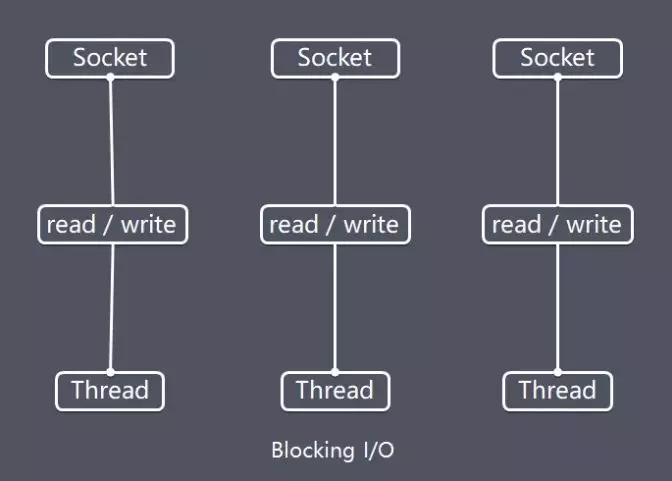

- NIO

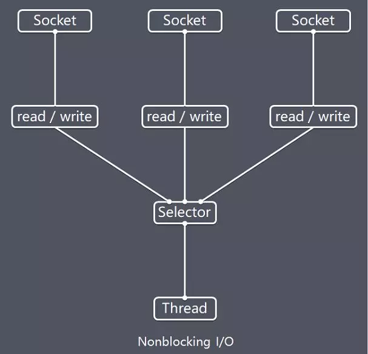

- IO复用模型

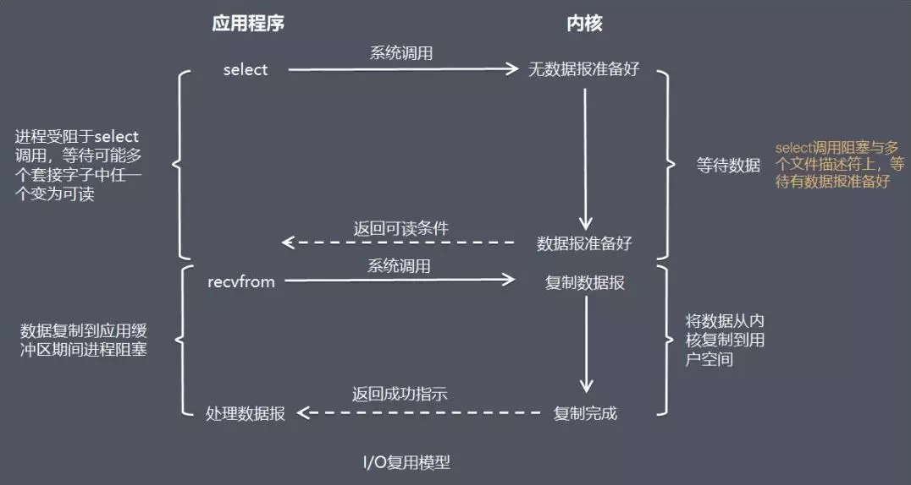


    选择器Selector是SelectableChannel的多路复用器，可以同时监控多个SelectableChannel的IO状况，即利用Selector可使一个单独的线程管理多个SelectableChannel，SelectableChannel设置为非阻塞。服务端为ServerSocketChannel，客户端为SocketChannel。


    通道使用register（Selector sel，int ops）方法将通道注册到选择器，第二个参数指定监听的事件类型。
       SelectionKey.OP_READ      (1)    0000 0001    读
       SelectionKey.OP_WRITE     (4)    0000 0100    写
       SelectionKey.OP_CONNECT   (8)    0000 1000    连接
       SelectionKey.OP_ACCEPT    (16)   0001 0000    接收
       Selector.open()                               创建一个Selector
       selector.select()                             阻塞等待监听的事件就绪，返回大于0说明有事件就绪
       selector.selectedKeys()                       获得就绪的事件，使用其iterator遍历SelectionKey，根据key判断事件类型
                                                        key.isAcceptable()、key.isReadable()，处理完移除
       wakeUp()                                      唤醒由于调用select()方法而阻塞的线程


### 2 reactor线程模型

- 单reactor单线程模型

    一个线程需要执行处理所有的accept、read、decode、process、encode、send事件，处理成百上千的链路时，导致大量客户端连接超时然后重发请求，导致更多堆积未处理的请求，成为性能瓶颈；
    可靠性低，一旦reactor线程假死或进入死循环，会导致整个系统通信模块不可用。

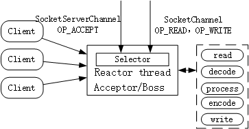


- 单reactor多线程模型

     一个Acceptor/Boss线程用于监听服务端，接收客户端的连接请求；
     多个Processor/Work线程池用于读写I/O。

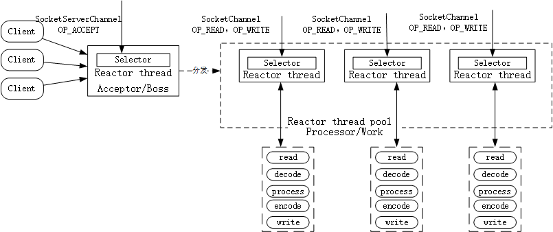


- 主从reactor多线程模型(再看看)

    多个Acceptor/Boss线程用于监听服务端，接收客户端的连接请求；
    多个Processor/Work线程池用于读写I/O 

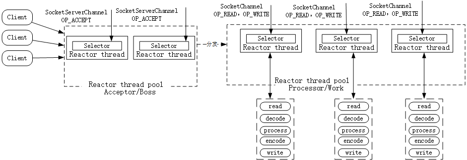

使用场景：
    当Kafka配置SSL、SASL时，可以配置多个listener监听多个端口，就是用到多个Acceptor
    listeners=PLAINTEXT://ngp32:9092,SSL://ngp32:9093,SASL_SSL://ngp32:9094

- Netty Reactor工作架构图

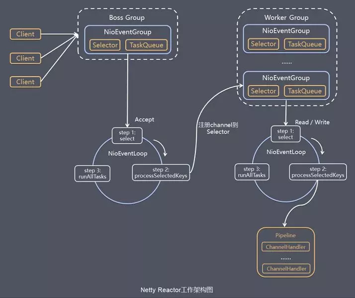


### 3 NettyServerBootstrap启动的详细过程

#### 3.1 ServerBootstrap配置源码

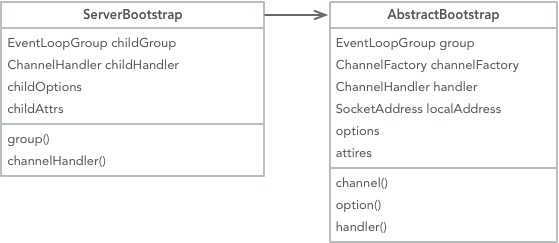

#### 3.2 bind流程

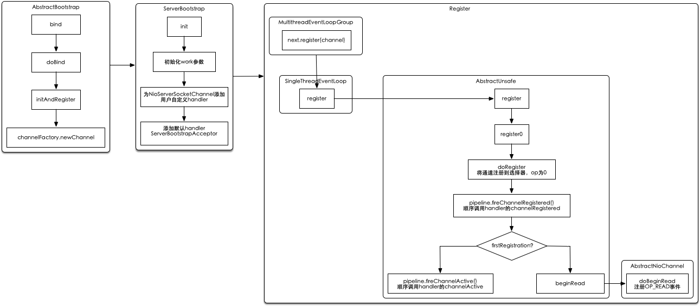


### 4 客户端接入流程


### 5 NioEventLoop读取channel数据流程


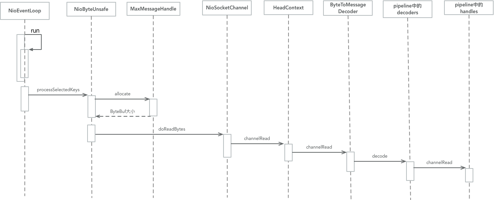


### 6 如何防止Netty服务端意外退出

- 方法1 同步

```

package com.mwt.netty.server;

import io.netty.bootstrap.ServerBootstrap;
import io.netty.channel.*;
import io.netty.channel.nio.NioEventLoopGroup;
import io.netty.channel.socket.SocketChannel;
import io.netty.channel.socket.nio.NioServerSocketChannel;

/**
 * Netty是一个异步非阻塞的通信框架，所有的I/O操作都是异步的，
 * 但是为了方便使用，例如在有些场景下应用需要同步等待一些I/O操作的结果，所以提供了ChannelFuture
 */
public class TimeServer {

    public void bind(int port) throws Exception {
        // boss group 服务端的TCP连接接入线程池
        final EventLoopGroup bossGroup = new NioEventLoopGroup(1);
        // worker group 处理客户端网络I/O读写的工作线程池 默认是处理器的2倍
        EventLoopGroup workerGroup = new NioEventLoopGroup();
        try {
            // 配置服务器的NIO线程租
            ServerBootstrap b = new ServerBootstrap();
            b.group(bossGroup, workerGroup)
                    // 设置接收连接的通道
                    .channel(NioServerSocketChannel.class)
                    .option(ChannelOption.SO_BACKLOG, 1024)
                    .option(ChannelOption.SO_KEEPALIVE, true)
                    .childHandler(new ChannelInitializer<SocketChannel>() {
                        @Override
                        protected void initChannel(SocketChannel socketChannel) throws Exception {
                            socketChannel.pipeline().addLast(new ChildChannelHandler());
                        }
                    });

            // 用同步阻塞方式绑定服务端监听端口。整个创建初始化注册是在bind()方法内
            // 端口绑定执行得非常快，完成后程序就继续向下执行
            ChannelFuture f = b.bind(port).sync();
            // 监听Close Future
            // 等待服务端监听端口关闭，通过sync或await，主动阻塞当前调用方的线程，等待操作结果，也就是通常说的异步转同步
            // main线程被阻塞在CloseFuture中，等待ChannelFuture关闭
            // 采用同步阻塞的方式来调用Netty，有点违背Netty的异步设计理念
            f.channel().closeFuture().sync();
        } finally {
            // 优雅退出，释放线程池资源
            bossGroup.shutdownGracefully();
            workerGroup.shutdownGracefully();
        }
    }

    private class ChildChannelHandler extends ChannelInitializer<SocketChannel> {
        @Override
        protected void initChannel(SocketChannel arg0) throws Exception {
            System.out.println("server initChannel..");
            arg0.pipeline().addLast(new TimeServerHandler());
        }
    }

    public static void main(String[] args) throws Exception {
        int port = 8091;
        if (args != null && args.length > 0) {
            try {
                port = Integer.valueOf(args[0]);
            } catch (NumberFormatException e) {

            }
        }

        new TimeServer().bind(port);
    }
}
```

- 方法2 异步

```
package com.mwt.netty.server;

import io.netty.bootstrap.ServerBootstrap;
import io.netty.channel.*;
import io.netty.channel.nio.NioEventLoopGroup;
import io.netty.channel.socket.SocketChannel;
import io.netty.channel.socket.nio.NioServerSocketChannel;

/**
 * Netty是一个异步非阻塞的通信框架，所有的I/O操作都是异步的，
 * 但是为了方便使用，例如在有些场景下应用需要同步等待一些I/O操作的结果，所以提供了ChannelFuture
 */
public class TimeServer {

    public void bind(int port) throws Exception {
        // boss group 服务端的TCP连接接入线程池
        final EventLoopGroup bossGroup = new NioEventLoopGroup(1);
        // worker group 处理客户端网络I/O读写的工作线程池 默认是处理器的2倍
        final EventLoopGroup workerGroup = new NioEventLoopGroup();
        try {
            // 配置服务器的NIO线程租
            ServerBootstrap b = new ServerBootstrap();
            b.group(bossGroup, workerGroup)
                    // 设置接收连接的通道
                    .channel(NioServerSocketChannel.class)
                    .option(ChannelOption.SO_BACKLOG, 1024)
                    .option(ChannelOption.SO_KEEPALIVE, true)
                    .childHandler(new ChannelInitializer<SocketChannel>() {
                        @Override
                        protected void initChannel(SocketChannel socketChannel) throws Exception {
                            socketChannel.pipeline().addLast(new ChildChannelHandler());
                        }
                    });

            // 用同步阻塞方式绑定服务端监听端口。整个创建初始化注册是在bind()方法内
            // 端口绑定执行得非常快，完成后程序就继续向下执行
            ChannelFuture f = b.bind(port).sync();

            // 通过注册监听器GenericFutureListener，可以异步等待I/O执行结果。
            // 增加了服务端连接关闭的监听事件之后，不会阻塞main()线程的执行
            // 调用方法线程返回
            f.channel().closeFuture().addListener(new ChannelFutureListener() {

                public void operationComplete(ChannelFuture future) throws Exception {
                    // 业务逻辑处理代码，此处省略
                    // 在监听器中释放资源
                    bossGroup.shutdownGracefully();
                    workerGroup.shutdownGracefully();
                    System.out.println(future.channel().toString() + "链路关闭");
                }
            });
        } finally {
            
        }
    }

    private class ChildChannelHandler extends ChannelInitializer<SocketChannel> {
        @Override
        protected void initChannel(SocketChannel arg0) throws Exception {
            System.out.println("server initChannel..");
            arg0.pipeline().addLast(new TimeServerHandler());
        }
    }

    public static void main(String[] args) throws Exception {
        int port = 8091;
        if (args != null && args.length > 0) {
            try {
                port = Integer.valueOf(args[0]);
            } catch (NumberFormatException e) {

            }
        }

        new TimeServer().bind(port);
    }
}
```


### 7 Netty中的优雅退出机制


#### 7.1 Java优雅退出机制

- 程序正常退出

```

/**
 * 程序正常退出的情况
 * 当main线程运行结束之后就会调用关闭钩子
 */
public class HookTest1 {

    public void start() {
        Runtime.getRuntime().addShutdownHook(new Thread(new Runnable() {
            public void run() {
                System.out.println("Execute Hook.....");
            }
        }));
    }

    public static void main(String[] args) {
        new HookTest().start();
        System.out.println("The Application is doing something");

        try {
            TimeUnit.MILLISECONDS.sleep(5000);
        } catch (InterruptedException e) {
            e.printStackTrace();
        }
    }
}

```

- 运行结果：

```

The Application is doing something
Execute Hook.....

Process finished with exit code 0

```

- System.exit()

- Ctrl+C

- OutOfMemory宕机

示例代码：

```

/**
 * 可以看到程序遇到内存溢出错误后调用关闭钩子，
 * 与第一种情况中，程序等待5000ms运行结束之后推出调用关闭钩子不同
 */
public class HookTest2 {
    public void start() {
        Runtime.getRuntime().addShutdownHook(new Thread(new Runnable() {
            public void run() {
                System.out.println("Execute Hook.....");
            }
        }));
    }

    public static void main(String[] args) {
        new HookTest().start();
        System.out.println("The Application is doing something");
        byte[] b = new byte[500 * 1024 * 1024];
        try {
            TimeUnit.MILLISECONDS.sleep(5000);
        } catch (InterruptedException e) {
            e.printStackTrace();
        }
    }

}


```

设置运行参数：

```

-Xmx20M

```

运行结果：

```

The Application is doing something
Exception in thread "main" java.lang.OutOfMemoryError: Java heap space
    at com.mwt.netty.server.shutdownhook.HookTest2.main(HookTest2.java:17)
Execute Hook.....

Process finished with exit code 1

```

- kill pid


- 注意点

```

(1) ShutdownHook在某些情况下并不会执行，例如JVM崩溃、无法接收信号量和kill -9 pid等

(2) 当存在多个ShutdownHook时，JVM无法保证它们的执行先后顺序

(3) 在JVM关闭期间不能动态添加或去除ShutdownHook

(4) 不能在ShutdownHook中调用System.exit(),它会卡住JVM，导致进程无法退出

```

- kill -9 pid的副作用

```

(1) 缓存中的数据尚未持久化到磁盘中，导致数据丢失

(2) 正在进行文件的write操作，没有更新完成，突然退出，导致文件损坏 

(3) 线程的消息队列中尚有接收到的请求消息还没来得及处理，导致请求消息丢失

(4) 数据库操作已完成，例如账户余额更新，准备返回应答消息给客户端时，消息尚在通信线程的发送队列中排队等待发送，进程强制退出导致应答消息没有返回给客户端，客户端发起超时重试，会带来重复更新问题

(5) 句柄资源没有及时释放等其他问题

```


#### 7.2 Netty优雅退出机制

- netty优雅退出涉及的预处理操作和资源释放

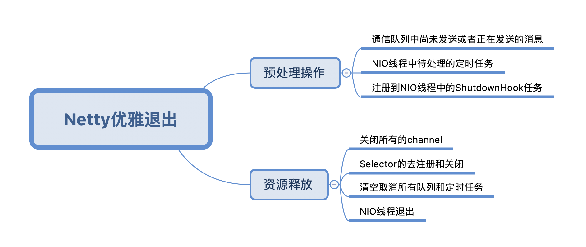

- netty优雅退出的流程图

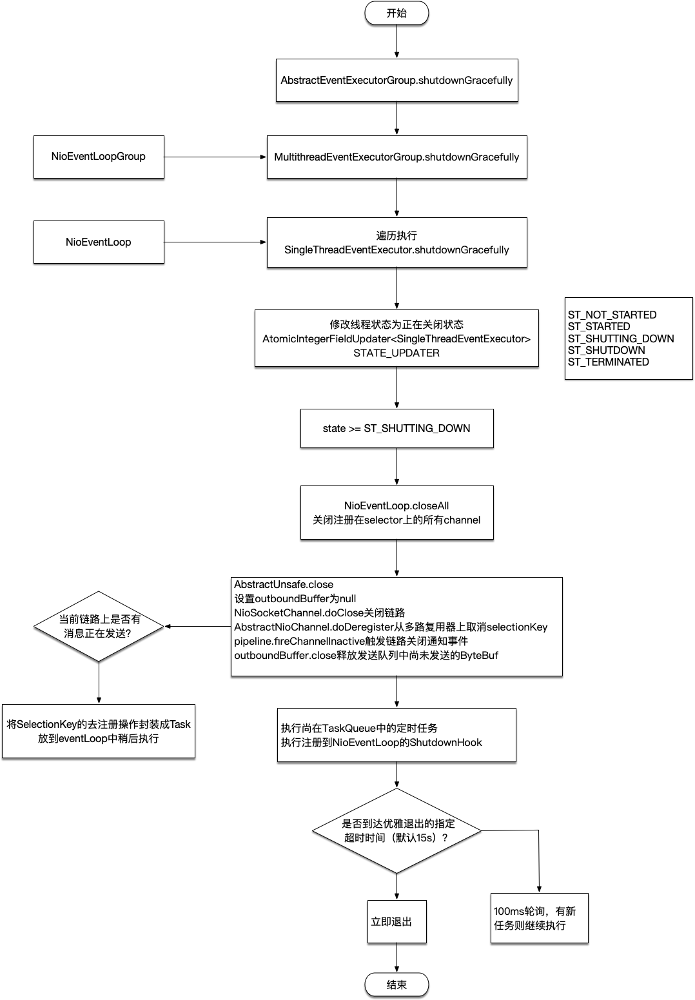

- Netty优雅退出的一些误区

```

1.保证不了优雅退出时所有消息队列排队的消息能够处理完：

(1) 待发送的消息：调用优雅退出方法之后，不会立即关闭链路。ChannelOutboundBuffer中的消息可以继续发送，本轮发送操作执行完成之后，无论是否还有消息尚未发送出去，在下一轮的Selector轮询中，链路都将被关闭，没有发送完成的消息将会被释放和丢弃。

(2) 需要发送的新消息：由于应用线程可以随时通过调用的Channel的write系列接口发送消息，即便ShutdownHook触发了Netty的优雅退出方法，在Netty优雅退出方法执行期间，应用线程仍然有可能继续调用Channel发送消息，这些消息将发送失败。

2.应用注册在NioEventLoop线程上的普通Task、Scheduled Task和ShutdownHook，也无法保证被完全执行，这取决于优雅退出超时时间和任务的数量，以及执行速度。

因此，应用程序的正确性不能完全依赖Netty的优雅退出机制，需要在应用层面做容错设计和处理。例如，服务端在返回响应之前关闭了，导致响应没有发送给客户端，这可能会触发客户端IO异常，或者超时异常，客户端需要采用Failover重试其他可用的服务端，而不能寄希望于服务端永远正确，Netty优雅退出更重要的是保证资源、句柄、线程的快速释放，以及相关对象的清理。

```

### 8 TCP粘包/拆包问题

#### 8.1 TCP粘包/拆包的基础知识

TCP是一个"流"协议，在业务上认为，一个完整的包可能会被拆分成多个包进行发送，也有可能把多个小的包封装成一个大的数据包发送，这就是所谓的TCP粘包/拆包问题。

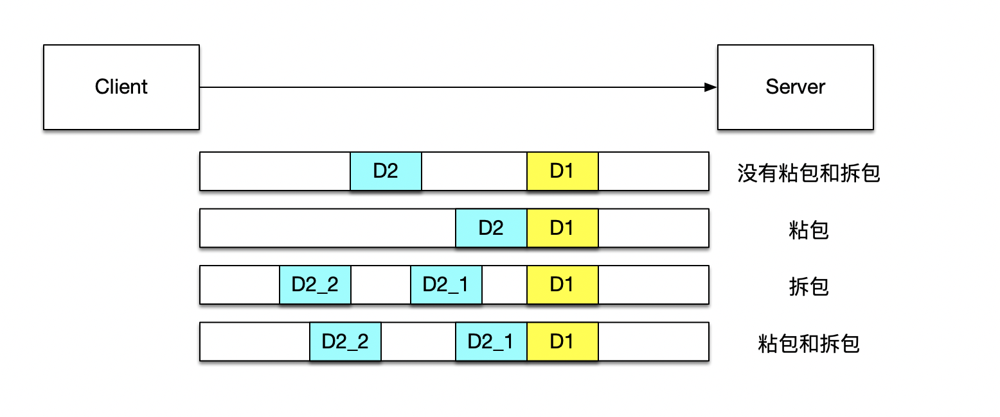

由于底层的TCP协议无法理解上层的业务数据，所以在底层不能保证数据包不被拆分和重组，这个问题只能通过上层的应用协议栈设计来解决：

- 消息定长，不够补空格
- 在包尾增加回车换行符进行分割
- 将消息分为消息头和消息体，消息头中包含消息总长度或消息体长度的字段
- 更复杂的应用层协议

#### 8.2 没考虑TCP粘包/拆包的问题案例

TCP粘包导致的读半包问题
查看example模块中的 TimeServerTcpStickyException 和 TimeClientTcpStickyException:

服务端只收到2条消息，说明客户端发送的消息发生了TCP粘包：
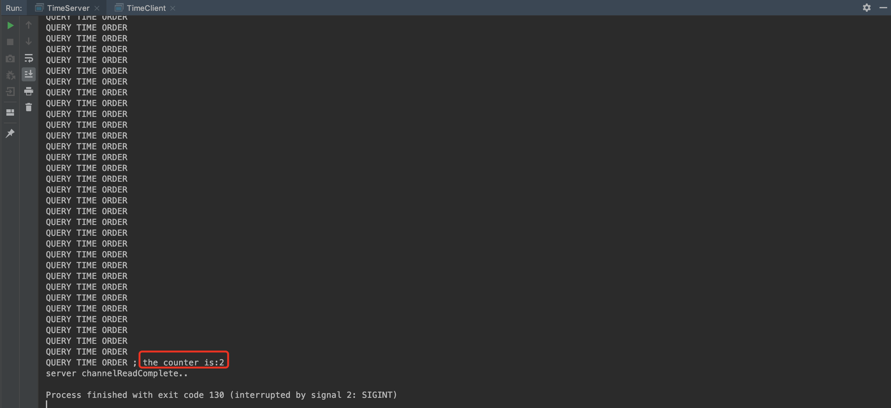

服务端只收到2条消息，因此只发送2条应答，但实际上客户端值收到一条包含2个"BAD ORDER"的消息，说明服务端返回的应答消息也发生了TCP粘包：


#### 8.3 使用Netty解决读半包问题

为了解决TCP粘包/拆包导致的问题，Netty默认提供了多种编解码器用于处理半包。

查看example模块中的 TimeServerFixTcpStickyException 和 TimeClientFixTcpStickyException:

分别在服务端和客户端添加 LineBasedFrameDecoder 和 StringDecoder 解决问题。

服务端正常收到客户端的100次请求：
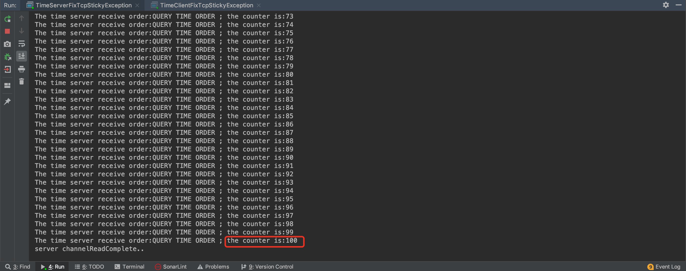

客户端正常收到服务端的100次应答消息：
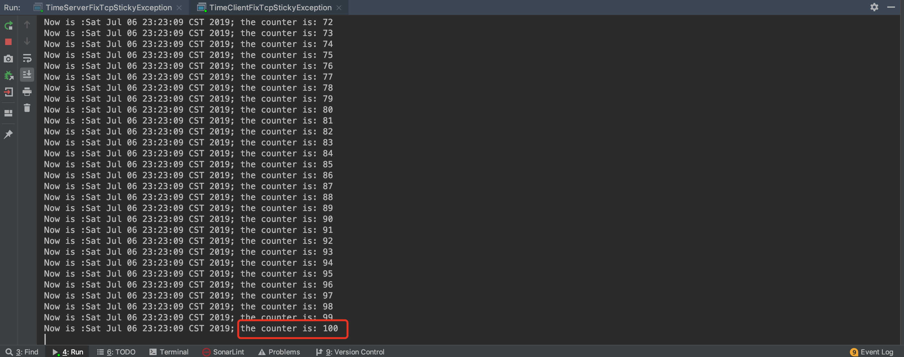


### 9 发送数据流程

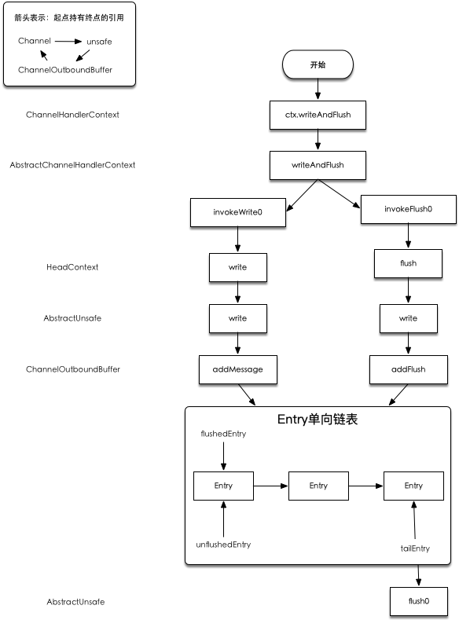

#### 9.1 轻量级对象池实现


